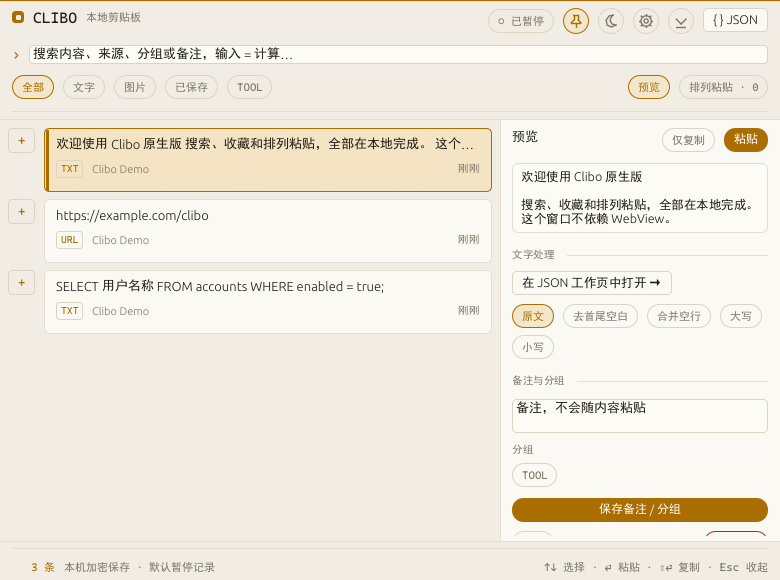
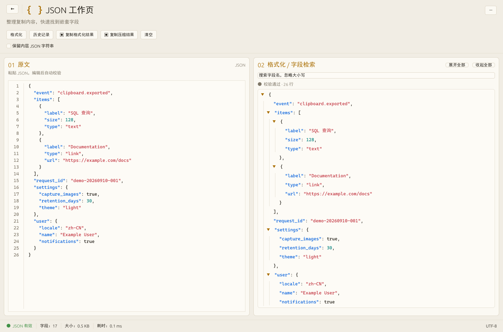
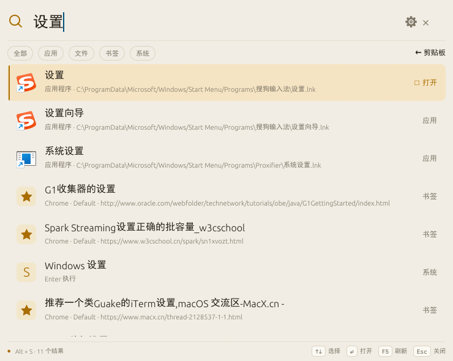

# Clibo

[中文](README.md) · English

Clibo is a native local clipboard manager built with Rust and egui. It is designed for a fast, lightweight, privacy-focused clipboard history experience on Windows.

Current version: **0.6.0 native preview**.

## Features

- Store text, links, and PNG / DIB image history.
- Chinese substring search, type filters, favorites, notes, and groups.
- Clipboard queues with reordering, sequential paste, merged paste, and recovery.
- Text tools for trimming whitespace, merging blank lines, and changing case.
- A JSON workspace with validation, formatting, tree expand / collapse, nested-field search, and compact / formatted copy.
- Global shortcuts, system tray, pinned panels, focus-loss hiding, and single-instance behavior.
- A launcher (Alt + S) that discovers Start Menu apps and searches custom entries, files, folders, and browser bookmarks.
- A temporary calculator entered by typing = in the search box.
- Timestamp conversion for seconds / milliseconds, date-time values, UTC offsets, and batches.
- Light / dark appearance with amber / blue-gray themes, image thumbnail previews, and a Ctrl+P preview drawer.
- Manual history backup and restore, with a safety backup created before restoration.
- Windows login startup without administrator privileges; Clibo can run in the tray after sign-in.

## Screenshots

  
  
  

  
  
  

The clipboard panel, JSON workspace, launcher, calculator, timestamp converter, and preferences are native views; processing stays local.

## Download

Windows x64 users can download the [Clibo 0.6.0](https://github.com/wushuang3625/clibo/releases/tag/v0.6.0) portable release. Extract the archive and run Clibo.exe; Node, WebView, and other runtimes are not required.

## Quick start

1. Start Clibo and click the recording control to begin capture.
2. Copy text, links, or images in any application.
3. Press Ctrl + Shift + V to open Clibo.
4. Search and select an entry. Press Enter to try pasting, or Shift + Enter to copy only.
5. Type > or the full-width 》 in the search box to enter command mode and open the JSON workspace, timestamp converter, launcher, or preferences.
6. Change the panel, queue, and launcher shortcuts in Preferences. The "In panel" group records JSON workspace and timestamp converter shortcuts that only apply while the Clibo window is active. Pressing Ctrl + Shift + V always returns to the clipboard page.

## Launcher

Press **Alt + S** to open the compact floating search box; you can also type > in the panel search box and pick “Launcher”, or use the tray menu. Press Alt + S or Esc again to dismiss it; clicking outside also hides it when the window is not pinned. The launcher is implemented natively by Clibo: it does not require Flow Launcher and does not include its plugin marketplace or third-party plugin runtime.

| Input | Function |
| --- | --- |
| Name, keyword | Search apps, custom entries, files, and bookmarks; fuzzy English matching, Chinese substring matching, most recently used first |
| `app name` | Search apps only |
| `file keyword` | Search files / folders; optional Everything query |
| Full path, `~`, `%USERPROFILE%` | Open a path, list matching children |
| `bm name` | Search local Chrome, Edge, Brave, and Firefox bookmarks |
| `g keyword` / `b keyword` / `bd keyword` | Google / Bing / Baidu web search; the browser opens only after execution |
| `= 12*3` or `12*3` | Local calculation; Enter copies the result |
| `> ` / `》 ` | List only Clibo built-in tools: clipboard history, JSON workspace, timestamp converter, preferences, index refresh |
| `sys keyword` | Windows settings, Task Manager, Recycle Bin, lock, shutdown, restart, and Clibo built-in tools |
| `https://example.com` | Open the URL |

- Select with ↑ / ↓ or Tab / Shift+Tab, open with Enter; Ctrl+Enter opens the containing folder, Ctrl+Shift+Enter requests an administrator launch.
- Right-click a result to copy its path / URL, open the containing folder, or edit / delete a custom entry. Shutdown and restart are confirmed again in the UI.
- Click the gear at the top right or press Ctrl+I to manage custom entries, search directories, and bookmark toggles. Custom entries, recents, search scope, and the Alt+S hotkey are stored in the local encrypted settings.
- Files index the Desktop, Documents, and Downloads folders by default; up to 20 extra directories can be added. Each directory scans at most 12,000 items, 10 levels deep, for about 3 seconds, skipping hidden directories, links, and common build directories; limits are reported in the management page. It is not a full-disk content index.
- Apps are discovered from the current user's and the common Start Menu. Apps load first in the background, then files and bookmarks; F5 refreshes the index, and file changes are not watched in real time.
- Everything is optional: install and run Everything, put the official `es.exe` on PATH or in the Everything install directory, and `file` queries will use it as well. If the service is unavailable or times out, a notice appears and local results remain. It does not depend on Flow Launcher.
- Alt+S can be changed in Clibo preferences; conflicts are reported when occupied, and other shortcuts keep working.
- Development run: `cargo run --manifest-path native/Cargo.toml -- --launcher` (exit any existing instance sharing the data directory first).

macOS keeps the application directory and local file search paths; Windows system actions and browser bookmark discovery are enabled on Windows only, and macOS has not been verified on a real device. There is currently no pinyin search, shell script execution, Flow plugin compatibility, or plugin marketplace.

## Data and privacy

Default data locations:

- Windows: %LOCALAPPDATA%\local.clibo.native\history.db
- macOS: ~/Library/Application Support/local.clibo.native/history.db

The UI theme and preview panel state are stored as ui-state.json in the same directory. Clipboard text, sources, images, and settings are stored in a local encrypted database: DPAPI on Windows, and AES-256-GCM with the system Keychain on macOS. Clibo does not upload clipboard contents.

For isolated tests or demos, set CLIBO_DATA_DIR to a separate directory:

~~~powershell
$env:CLIBO_DATA_DIR = "D:\CliboTestData"
~~~

## Build from source

Rust 1.95.0 is required and pinned by rust-toolchain.toml. Windows also requires Visual Studio C++ Build Tools; macOS requires Xcode Command Line Tools.

~~~powershell
cargo fmt --check --manifest-path native/Cargo.toml
cargo test --locked --manifest-path native/Cargo.toml
cargo clippy --locked --manifest-path native/Cargo.toml -- -D warnings
cargo build --release --locked --manifest-path native/Cargo.toml
~~~

Run the development build:

~~~powershell
cargo run --manifest-path native/Cargo.toml
~~~

Build and export portable files:

~~~powershell
npm run native:build
~~~

On Windows, the export directory is output/native/:

~~~text
Clibo.exe
使用说明.md
SHA256.txt
~~~

Node is only used by the export script; it is not required to run Clibo.

## Release

When releasing a new version, update the version in both package.json and native/Cargo.toml, then create and push a version tag:

~~~powershell
git tag -a vX.Y.Z -m "Clibo X.Y.Z"
git push origin vX.Y.Z
~~~

Pushing vX.Y.Z runs the checks, builds the Windows x64 portable package, generates a SHA256 file, and creates a GitHub Release. The workflow is [.github/workflows/release.yml](.github/workflows/release.yml).

## Platform status

- Windows x64: portable release available.
- macOS: native platform code and CI checks are present, but .app packaging, signing, and real-device validation are not complete.
- There is currently no installer, auto-updater, or code signing.

## Project layout

~~~text
native/                       Rust native application
scripts/export-native.mjs     Build artifact export script
.github/workflows/            CI and release workflows
~~~

## Contributing

Issues and pull requests are welcome. Before submitting a change, run formatting checks, tests, and Clippy, and include the operating system and reproduction steps when reporting a problem.

## License

This project is licensed under the [MIT License](LICENSE).
